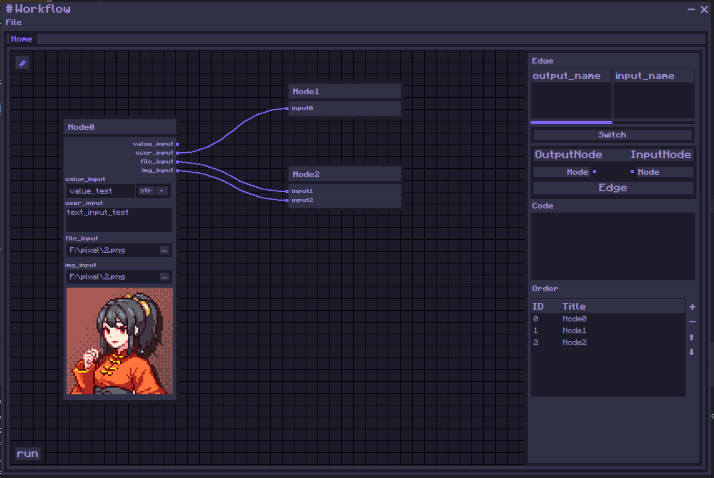

# PixelUI-tkinter - Customized Pixel UI Based on tkinter
Customized Pixel UI Based on tkinter / 基于tkinter的定制化像素UI

开发环境为windows11，不确定在其他系统中是否会出现布局错误，并且由于tkinter通过文件加载字体比较麻烦，这里采用的是直接从系统字体中读取，所以需要您手动安装这些字体依赖：
The development environment is Windows 11, and it is uncertain whether layout errors may occur in other systems. Additionally, due to the difficulty of loading fonts through files in tkinter, we use direct reading from system fonts. Therefore, you need to manually install these font dependencies:
- fusion-pixel-12px-monospaced-zh_hans.ttf
- Minecraft AE.ttf



这是一套基于原生 Tkinter 封装的**像素风格**UI控件库，通过统一的基类 `Module` 实现了高可复用、易扩展的组件体系，包含窗口系统、基础交互控件、数据展示组件、工作流组件等，所有控件均遵循一致的设计规范，轻松构建复古像素风桌面应用。

This is a pixel-style UI control library encapsulated based on native Tkinter. It implements a highly reusable and easily extensible component system through the unified base class `Module`, including window systems, basic interactive controls, data display components, workflow components, etc. All controls follow consistent design specifications, making it easy to build retro pixel-style desktop applications.

---

## 🖼️ 窗口系统控件 - Window System Widgets
窗口系统负责应用的主窗口、子窗口与弹窗交互，所有窗口均支持像素风样式自定义。

The window system is responsible for the interaction of the application's main window, sub-windows and pop-ups. All windows support custom pixel-style styling.

### `Win` - 主窗口 - Main Window
应用的根窗口，是所有UI组件的容器，封装了Tkinter `Tk` 的核心能力：
- 支持像素风标题栏、边框样式自定义
- 内置窗口生命周期管理（关闭、最小化、居中）
- 全局样式与主题配置入口

The root window of the application, which serves as the container for all UI components and encapsulates the core capabilities of Tkinter `Tk`:
- Supports custom pixel-style title bars and border styles
- Built-in window lifecycle management (close, minimize, center)
- Entry point for global style and theme configuration

### `Toplevel(Win)` - 副窗口/子窗口 - Toplevel / Sub Window
继承自 `Win`，用于创建独立的子窗口/弹窗：
- 与主窗口共享全局样式
- 支持模态/非模态窗口配置
- 可独立设置窗口层级与置顶属性

Inherited from `Win`, used to create independent sub-windows/pop-ups:
- Shares global styles with the main window
- Supports modal/non-modal window configuration
- Can independently set window hierarchy and topmost attributes

### `MessageBox` - 消息提醒框 - Message Box
轻量级弹窗，用于展示纯文本提示信息：
- 预设信息/警告/错误等常用提示样式
- 自动居中于父窗口
- 支持自定义按钮文本与回调

A lightweight pop-up for displaying plain text prompt information:
- Preset common prompt styles such as info/warning/error
- Automatically centers relative to the parent window
- Supports custom button text and callbacks

### `ConfirmationBox(MessageBox)` - 确认弹窗 - Confirmation Box
继承自 `MessageBox`，用于需要用户确认的交互场景：
- 提供“确认/取消”双按钮
- 支持绑定确认/取消的回调函数
- 可自定义弹窗图标与提示文本

Inherited from `MessageBox`, used for interactive scenarios that require user confirmation:
- Provides dual "Confirm/Cancel" buttons
- Supports binding callback functions for confirm/cancel
- Allows custom pop-up icons and prompt text

### `MenuWin` - 菜单窗口 - Menu Window
独立的菜单/右键菜单容器，支持像素风菜单样式：
- 多级菜单嵌套支持
- 菜单项点击事件绑定
- 支持自定义菜单图标与分隔线

An independent menu/right-click menu container that supports pixel-style menu styling:
- Supports multi-level menu nesting
- Binds click events for menu items
- Supports custom menu icons and separators

---

## 🧩 基础交互控件 - Basic Interactive Widgets
所有控件均继承自 `Module` 基类，提供统一的接口规范，支持像素风样式配置。

All controls inherit from the `Module` base class, providing a unified interface specification and supporting pixel-style configuration.

### 输入与展示类 - Input & Display Widgets

| 控件名 | 说明 | 典型场景 |
|--------|------|----------|
| `Label(Module)` | 像素风格文本标签，支持多行文本与自定义字体 | 静态文本展示、标题、说明文字 |
| `ImgLabel(Module)` | 图片展示标签，支持像素风图片渲染 | 图标展示、背景图、预览图 |
| `Entry(Module)` | 单行输入框，支持像素风边框与输入限制 | 用户名/密码输入、单行文本录入 |
| `Text(Module)` | 多行文本框，支持滚动条与文本编辑 | 大段文本输入、日志展示 |
| `MarkdownText(Module)` | Markdown渲染文本框，支持像素风样式适配 | 帮助文档、富文本说明 |

| Widget Name | Description | Typical Scenarios |
|-------------|-------------|-------------------|
| `Label(Module)` | Pixel-style text label, supports multi-line text and custom fonts | Static text display, titles, explanatory text |
| `ImgLabel(Module)` | Image display label, supports pixel-style image rendering | Icon display, background images, preview images |
| `Entry(Module)` | Single-line input box with pixel-style borders and input restrictions | Username/password input, single-line text entry |
| `Text(Module)` | Multi-line text box with scroll bar and text editing | Large text input, log display |
| `MarkdownText(Module)` | Markdown rendering text box with pixel-style adaptation | Help documents, rich text descriptions |

### 交互与选择类 - Interaction & Selection Widgets

| 控件名 | 说明 | 典型场景 |
|--------|------|----------|
| `Button(Module)` | 像素风格按钮，支持悬停/点击状态切换 | 提交、确认、取消等操作按钮 |
| `CheckBox(Module)` | 复选框控件，支持多选项选择 | 多选配置项、同意协议勾选 |
| `OptionBox(Module)` | 互斥单选框，同一组内仅可选择一项 | 单选配置项、模式选择 |
| `ChoiceBox(Module)` | 下拉选择框，支持自定义选项列表 | 下拉选项选择、分类筛选 |
| `ScrollBar(Module)` | 滚动条控件，支持垂直/水平滚动 | 长文本/列表的滚动控制 |

| Widget Name | Description | Typical Scenarios |
|-------------|-------------|-------------------|
| `Button(Module)` | Pixel-style button supporting hover/click state switching | Operation buttons such as submit, confirm, cancel |
| `CheckBox(Module)` | Checkbox control supporting multi-option selection | Multi-select configuration items, agreement confirmation check |
| `OptionBox(Module)` | Mutually exclusive radio box, only one option can be selected in the same group | Single-select configuration items, mode selection |
| `ChoiceBox(Module)` | Drop-down selection box supporting custom option lists | Drop-down option selection, category filtering |
| `ScrollBar(Module)` | Scroll bar control supporting vertical/horizontal scrolling | Scrolling control for long text/lists |

---

## 📊 数据与进度展示控件 - Data & Progress Display Widgets
用于数据可视化与进度反馈的专用控件：

Special controls for data visualization and progress feedback:

### `ProgressBar(Module)` - 进度条 - Progress Bar
带进度值的进度展示控件：
- 支持自定义进度范围（0-100或任意数值）
- 像素风填充样式，支持前景/背景色配置
- 可绑定进度更新回调

A progress display control with progress values:
- Supports custom progress ranges (0-100 or any value)
- Pixel-style fill style, supports foreground/background color configuration
- Can bind progress update callbacks

### `LoadingBar(Module)` - 加载动画条 - Loading Bar
无明确进度的加载状态展示控件：
- 循环动画效果，模拟加载过程
- 支持自定义动画速度与颜色
- 适用于未知时长的异步操作

A loading state display control without clear progress:
- Cyclic animation effect to simulate the loading process
- Supports custom animation speed and colors
- Suitable for asynchronous operations of unknown duration

### `Table(Module)` - 表格组件 - Table Component
像素风格的表格控件，支持数据展示与编辑：
- 支持多列数据、表头自定义
- 单元格文本对齐、样式配置
- 支持行/列点击事件绑定、排序功能

A pixel-style table control supporting data display and editing:
- Supports multi-column data and custom table headers
- Cell text alignment and style configuration
- Supports row/column click event binding and sorting functions

---

## 🔧 高级组件：工作流系统 - Advanced Components: Workflow System
内置工作流可视化组件，支持节点式流程搭建：

Built-in workflow visualization components supporting node-based process construction:

### `WorkFlow(Module)` - 工作流容器 - Workflow Container
工作流的画布容器，用于承载所有节点组件：
- 支持画布拖拽、缩放
- 节点连线与流程关系管理
- 支持自定义画布背景与网格线

The canvas container for workflows, used to carry all node components:
- Supports canvas dragging and zooming
- Manages node connections and process relationships
- Supports custom canvas backgrounds and grid lines

### `WorkFlowNode(Module)` - 工作流节点 - Workflow Node
工作流中的基础节点单元：
- 支持自定义节点形状、颜色与图标
- 输入/输出端口配置
- 节点拖拽、连接与点击事件绑定

The basic node unit in a workflow:
- Supports custom node shapes, colors and icons
- Input/output port configuration
- Node dragging, connection and click event binding

---

## ✨ 控件库设计优势 - Design Advantages of the Control Library
1.  **统一基类，易于扩展**：所有控件继承自 `Module`，可快速添加通用功能（如样式、事件）
2.  **像素风统一设计**：所有控件均适配像素化视觉风格，保持应用整体一致性
3.  **接口简洁易用**：封装了Tkinter原生控件的复杂配置，提供更友好的API
4.  **高可定制性**：支持自定义颜色、字体、边框、状态样式，适配不同场景需求

1.  **Unified Base Class, Easy to Extend**: All controls inherit from `Module`, allowing quick addition of common functions (such as styles, events)
2.  **Unified Pixel-style Design**: All controls adapt to the pixelated visual style, maintaining overall application consistency
3.  **Simple and Easy-to-use Interface**: Encapsulates the complex configurations of native Tkinter controls and provides a more friendly API
4.  **High Customizability**: Supports custom colors, fonts, borders and state styles to adapt to the needs of different scenarios

---

## 🚀 快速上手示例 - Quick Start Example
```python
# 示例：创建主窗口并添加像素风按钮
# Example: Create a main window and add a pixel-style button
from PixelUI import Win, Button

# 创建主窗口
# Create the main window
root = Win(title="像素风应用", size=(800, 600))

# 创建像素风格按钮
# Create a pixel-style button
btn = Button(root.screen_frame, text="点击我", command=lambda: print("按钮被点击啦！"))
btn.place(x=5, y=5)

# 启动主循环
# Start the main loop
root.mainloop()
```

---

# 🎨 风格化定制 - Styling Customization

你可以通过修改PixelUI.py中的颜色字典来更改你需要的风格：

You can change the style you need by modifying the color dictionary in PixelUI.py:

```python 
# 配色方案
# Color Scheme
col_dict = {
    "pass": "#1cff6a",  # 0 通过 pass
    "reminder": "#ffe500",  # 1 警告 reminder
    "error": "#ff1c50",  # 2 错误 error

    "light": "#8064ff",  # 3 光 light
    "main": "#303047",  # 4 界面主色 main interface color
    "bg": "#1b1b2a",  # 5 背景色 background color
    "text": "#9e8cd2",  # 6 文字 text color
}
```
